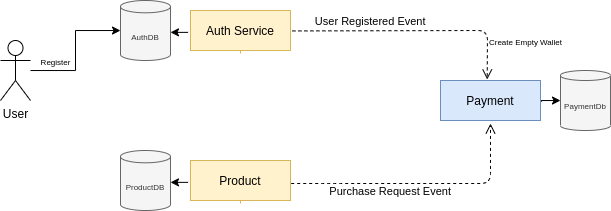
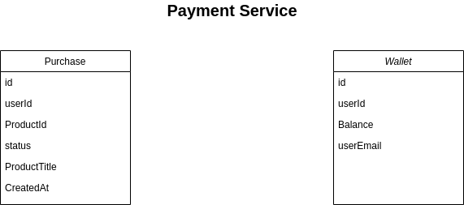

# E-commerce App

### Quick Start

```
export APP_ENV=development
```

# Services

<!--ts-->

- [Wallet Service](#wallet-service)
- [Kafka Service](#kafka-service)
<!--te-->

# Payment Service

Payment Service Handles Logic Related to User Balance and Request New Purchase Logic
so everytime There is A New Event with user-registered event
the Wallet Service Consume it and creates a new Wallet for the User With Balance (0)



### Payment Service Models



### Nice To Have

Separate Payment Service Logic to Have The Following

- **Wallet Service** will have User Data and it's Wallet
- **Payment Service** will Handle Transaction Process Only

# Kafka Service

have Standalone kafka Service handle Messages Over Our Microservice
