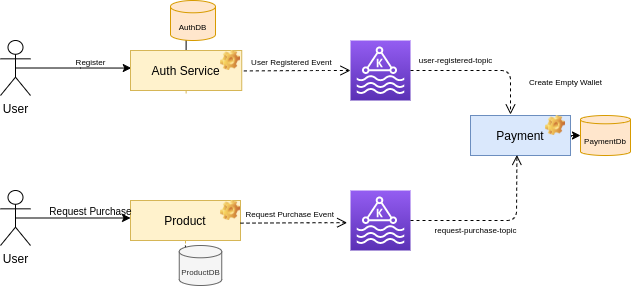
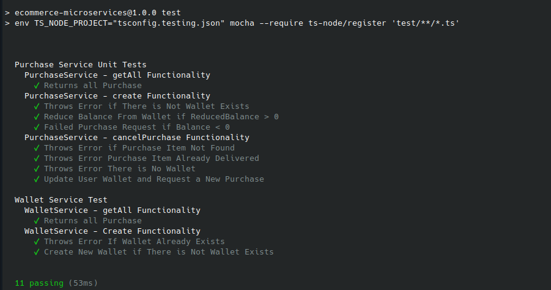

# E-commerce App

implement the e-commerce system using the following stack (Mysql, Nodejs) With Docker, Jenkins and Kafka To Handle Messages Over Microservices Architecture

### System Design Overview

We Have Mainly Three Services Payment Service, Product Service and Authentication Services Communicates With Each Other Through
Kafka Instance


# Services

<!--ts-->

- [Payment Service](#payment-service)
- [Authentication Service](#authentication-service)
- [Product Service](#product-service)
- [Kafka Service](#kafka-service)
- [Key Features](#key-features)
- [What we Have](#what-we-have)
- [Nice To Have](#nice-to-have)

<!--te-->

# Key Features

- Setup Authentication Service
- Product Crud Operations
- Setup Payment Service
- Setup Kafka
- Kafka Produce Events
- User Registered Event & Create New Wallet
- Request Product Logic >> Populate to Payment Service
- Cancel Purchase Event Logic
- Get Product Less than or Equal User Allowed Limit
- Query Service to Query all User Orders
- Database SEED With Migration
- Pagination Package
- Unit Tests
- Deploy With Jenkins

# Payment Service

Payment Service Handles Logic Related to User Balance and Request New Purchase Logic
so everytime There is A New Event with user-registered event
the Wallet Service Consume it and creates a new Wallet So we have two nice Features Here

### Features

- Request New Purchase
- Cancel Purchases
- User Wallet (**Balance**) Logic


# Authentication Service

Stand Alone Service Handle all the Logic Related to User Signin/Signup
also There is a Package for our auth Middleware so if i need to Validate a Specific User
Instead of Every Time Need To Send a **Sync Request** to Validate it Every Service will have it own package so easily can validate the user
With Depend On The Authentication Service to Validate it so we have Two Benefits Here

### Features

- Don't need to Send a **SYNC Request** To Validate The User
- More **Durability** Over Microservices so no Service Depends on Auth Service to Validate User Data

# Product Service

Standalone service to Handle The Logic Related to all Products and It's Categories related to it
so it's very nice one For logistics People

### Features

- Handle Product/Categories Logic

# Kafka Service

Kafka Service Handles the Async Communication Between Service Like User Wallet and Request Purchase Events

# What we Have

- Microservices Architecture
- Messaging Using Kafka to Populate All Events
- Standalone Payment Service to Handle all Logic Related to User Transaction & applying ACID Via it
- Centralize Authentication Services as A Package TO Avoid Sync Communication Over Microservices Architecture
- All Services Containerized
- App Response & App Errors Packages all Over Services
- One Pagination Package all Over Services
- Unit Test
- Jenkins Scripting for CI/CD Deployment Feature

# Nice To Have

Separate Payment Service Logic to Have The Following

- **Wallet Service** will have User Data and it's Wallet
- **Payment Service** will Handle Transaction Process Only
- Kubernetes to Control Object Scaling Automatic
- Skaffold at the dev environment better than docker-compose
- More Features with Jenkins
- Big Organization and each Service Have it's Own Repository
- Private npm Package because JWT Key must be secure There and our package cannot be public
- Using Nestjs Over Express to take a lot of benefits and the most important one is IOC Container so i can have Singleton + Dependency Injection out of the box

# Quick Start

- Put the Following on your /etc/hosts files

```
127.0.0.1       localhost kafka

172.28.0.10 product.local
172.28.0.11 productdb.local
172.28.0.12 auth.local
172.28.0.13 auth-db.local

172.28.0.14 payment.local
172.28.0.15 paymentdb.local

```

- Run These Two Commands

```
export APP_ENV=development
docker-compose up

```

- Test Runner

```
cd servers/payment && npm run test
```


